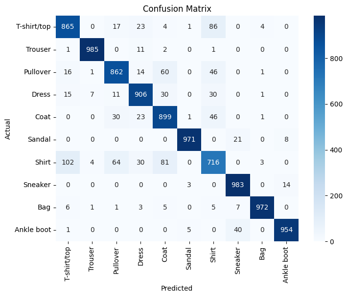
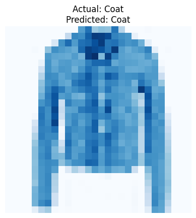

# Develop a Convolutional Deep Neural Network for Image Classification

## AIM
To develop a convolutional deep neural network (CNN) for image classification and to verify the response for new images.

##   PROBLEM STATEMENT AND DATASET
Include the Problem Statement and Dataset.

## Neural Network Model
Include the neural network model diagram.

## DESIGN STEPS
### STEP 1: 

Write your own steps

### STEP 2: 


### STEP 3: 


### STEP 4: 


### STEP 5: 


### STEP 6: 


## PROGRAM

### Name:

### Register Number:

```python
import torch
import torch.nn as nn
import torch.optim as optim
import torchvision
import torchvision.transforms as transforms
from torch.utils.data import DataLoader
import matplotlib.pyplot as plt
import numpy as np
from sklearn.metrics import confusion_matrix, classification_report
import seaborn as sns
```


```python
## Step 1: Load and Preprocess Data
# Define transformations for images
transform = transforms.Compose([
    transforms.ToTensor(),          # Convert images to tensors
    transforms.Normalize((0.5,), (0.5,))  # Normalize images
])
```


```python
# Load Fashion-MNIST dataset
train_dataset = torchvision.datasets.FashionMNIST(root="./data", train=True, transform=transform, download=True)
test_dataset = torchvision.datasets.FashionMNIST(root="./data", train=False, transform=transform, download=True)
```


```python
# Get the shape of the first image in the training dataset
image, label = train_dataset[0]
print(image.shape)
print(len(train_dataset))
```


```python
# Get the shape of the first image in the test dataset
image, label = test_dataset[0]
print(image.shape)
print(len(test_dataset))
```


```python
# Create DataLoader for batch processing
train_loader = DataLoader(train_dataset, batch_size=32, shuffle=True)
test_loader = DataLoader(test_dataset, batch_size=32, shuffle=False)

```


```python
import torch
import torch.nn as nn

class CNNClassifier(nn.Module):
    def __init__(self):
        super(CNNClassifier, self).__init__()

        self.conv1 = nn.Conv2d(in_channels=1, out_channels=32, kernel_size=3, padding=1)
        self.conv2 = nn.Conv2d(in_channels=32, out_channels=64, kernel_size=3, padding=1)
        self.conv3 = nn.Conv2d(in_channels=64, out_channels=128, kernel_size=3, padding=1)
        self.pool = nn.MaxPool2d(kernel_size=2, stride=2)
        self.fc1 = nn.Linear(128 * 3 * 3, 128)
        self.fc2 = nn.Linear(128, 64)
        self.fc3 = nn.Linear(64, 10)

    def forward(self, x):
        x = self.pool(torch.relu(self.conv1(x)))
        x = self.pool(torch.relu(self.conv2(x)))
        x = self.pool(torch.relu(self.conv3(x)))
        x = x.view(x.size(0), -1)

        x = torch.relu(self.fc1(x))
        x = torch.relu(self.fc2(x))
        x = self.fc3(x)

        return x
```


```python
from torchsummary import summary

# Initialize model
model = CNNClassifier()

# Move model to GPU if available
if torch.cuda.is_available():
    device = torch.device("cuda")
    model.to(device)

# Print model summary
print('Name:        Sudharsan S')
print('Register Number:       212224040334')
summary(model, input_size=(1, 28, 28))
```
```
    Name:        Sudharsan S
    Register Number:       212224040334
    ----------------------------------------------------------------
            Layer (type)               Output Shape         Param #
    ================================================================
                Conv2d-1           [-1, 32, 28, 28]             320
             MaxPool2d-2           [-1, 32, 14, 14]               0
                Conv2d-3           [-1, 64, 14, 14]          18,496
             MaxPool2d-4             [-1, 64, 7, 7]               0
                Conv2d-5            [-1, 128, 7, 7]          73,856
             MaxPool2d-6            [-1, 128, 3, 3]               0
                Linear-7                  [-1, 128]         147,584
                Linear-8                   [-1, 64]           8,256
                Linear-9                   [-1, 10]             650
    ================================================================
    Total params: 249,162
    Trainable params: 249,162
    Non-trainable params: 0
    ----------------------------------------------------------------
    Input size (MB): 0.00
    Forward/backward pass size (MB): 0.42
    Params size (MB): 0.95
    Estimated Total Size (MB): 1.37
    ----------------------------------------------------------------
    
```

```python
# Initialize model, loss function, and optimizer
model = CNNClassifier()
criterion = nn.CrossEntropyLoss()
optimizer = optim.Adam(model.parameters(), lr=0.001)
```


```python
## Step 3: Train the Model
def train_model(model, train_loader, num_epochs=3):
    for epoch in range(num_epochs):
        model.train()
        running_loss = 0.0
        for images, labels in train_loader:
          optimizer.zero_grad()
          outputs = model(images)
          loss = criterion(outputs, labels)
          loss.backward()
          optimizer.step()
          running_loss += loss.item()


        print('Name:        Sudharsn S')
        print('Register Number:       212224040334')
        print(f'Epoch [{epoch+1}/{num_epochs}], Loss: {running_loss/len(train_loader):.4f}')

```


```python
# Train the model
train_model(model, train_loader)

```

    Name:        Sudharsn S
    Register Number:       212224040334
    Epoch [1/3], Loss: 0.4722
    Name:        Sudharsn S
    Register Number:       212224040334
    Epoch [2/3], Loss: 0.2860
    Name:        Sudharsn S
    Register Number:       212224040334
    Epoch [3/3], Loss: 0.2376
    


```python
## Step 4: Test the Model
def test_model(model, test_loader):
    model.eval()
    correct = 0
    total = 0
    all_preds = []
    all_labels = []

    with torch.no_grad():
        for images, labels in test_loader:
            outputs = model(images)
            _, predicted = torch.max(outputs, 1)
            total += labels.size(0)
            correct += (predicted == labels).sum().item()
            all_preds.extend(predicted.cpu().numpy())
            all_labels.extend(labels.cpu().numpy())

    accuracy = correct / total
    print('Name:        Sudharsan S')
    print('Register Number:       212224040334')
    print(f'Test Accuracy: {accuracy:.4f}')

    # Compute confusion matrix
    cm = confusion_matrix(all_labels, all_preds)
    plt.figure(figsize=(8, 6))
    print('Name:        Sudharsan S')
    print('Register Number:       212224040334')
    sns.heatmap(cm, annot=True, fmt='d', cmap='Blues', xticklabels=test_dataset.classes, yticklabels=test_dataset.classes)
    plt.xlabel('Predicted')
    plt.ylabel('Actual')
    plt.title('Confusion Matrix')
    plt.show()

    # Print classification report
    print('Name:        Sudharsan S')
    print('Register Number:       212224040334')
    print("Classification Report:")
    print(classification_report(all_labels, all_preds, target_names=test_dataset.classes))

```


```python
# Evaluate the model
test_model(model, test_loader)

```

    Name:        Sudharsan S
    Register Number:       212224040334
    Test Accuracy: 0.9113
    Name:        Sudharsan S
    Register Number:       212224040334
    


    

    
```

    Name:        Sudharsan S
    Register Number:       212224040334
    Classification Report:
                  precision    recall  f1-score   support
    
     T-shirt/top       0.86      0.86      0.86      1000
         Trouser       0.99      0.98      0.99      1000
        Pullover       0.88      0.86      0.87      1000
           Dress       0.90      0.91      0.90      1000
            Coat       0.83      0.90      0.86      1000
          Sandal       0.99      0.97      0.98      1000
           Shirt       0.77      0.72      0.74      1000
         Sneaker       0.94      0.98      0.96      1000
             Bag       0.99      0.97      0.98      1000
      Ankle boot       0.98      0.95      0.97      1000
    
        accuracy                           0.91     10000
       macro avg       0.91      0.91      0.91     10000
    weighted avg       0.91      0.91      0.91     10000
    
    
```

```python
## Step 5: Predict on a Single Image
import matplotlib.pyplot as plt
def predict_image(model, image_index, dataset):
    model.eval()
    image, label = dataset[image_index]
    with torch.no_grad():
        output = model(image.unsqueeze(0))  # Add batch dimension
        _, predicted = torch.max(output, 1)
    class_names = dataset.classes

    # Display the image
    print('Name:        Sudharsan S')
    print('Register Number:       212224040334')
    plt.imshow(image.squeeze(), cmap="Blues")
    plt.title(f'Actual: {class_names[label]}\nPredicted: {class_names[predicted.item()]}')
    plt.axis("off")
    plt.show()
    print(f'Actual: {class_names[label]}, Predicted: {class_names[predicted.item()]}')

```


```python
# Example Prediction
predict_image(model, image_index=10|0, dataset=test_dataset)
```

    Name:        Sudharsan S
    Register Number:       212224040334
    


    

    


    Actual: Coat, Predicted: Coat
    


### OUTPUT

## Training Loss per Epoch

Include the Training Loss per epoch

## Confusion Matrix

Include confusion matrix here

## Classification Report
Include classification report here

### New Sample Data Prediction
Include your sample input and output here

## RESULT
Include your result here
